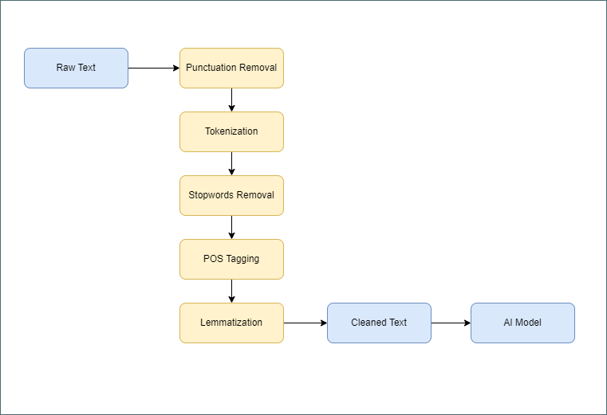

# Automatic Question Tagging System using a From-Scratch Transformer on Stack Overflow Data

## Table of Contents

1. [Problem Definition](#problem-definition)
2. [Dataset Overview](#dataset-overview)
3. [Data Cleaning and Preparation](#data-cleaning-and-preparation)
4. [Preprocessing and Feature Representation](#preprocessing-and-feature-representation)
5. [Transformer Model Training and Evaluation](#transformer-model-training-and-evaluation)
6. [Acknowledgments](#acknowledgments)

## Problem Definition

Online Q&A platforms like Stack Overflow and Quora often ask users to provide tags when submitting questions to help categorize them. However, users may sometimes provide inaccurate or irrelevant tags, making it harder for others to navigate and find relevant information. An automatic question tagging system can address this issue by identifying the correct and relevant tags for a submitted question.

In this project, we aim to build a multi-label classification model that automatically tags questions based on their content.

## Dataset Overview

The dataset used for this project is a 10% sample from Stack Overflow Q&A available on Kaggle: [StackSample](https://www.kaggle.com/datasets/stackoverflow/stacksample).

The dataset contains over 1 million questions with tags and answers. For this project, only the **questions** and **tags** were used, as the answers were not relevant for the task of automatic question tagging.

Additionally, the dataset includes metadata such as user IDs, question creation dates, closure dates, and question scores. However, only the questions and tags were necessary for the scope of this project.

## Data Cleaning and Preparation

Several steps were taken to clean and prepare the data:

- **Combining Data**: The questions and their respective tags were combined into one dataframe.
- **Filtering by Score**: Questions with a score below a certain threshold (experimentally set to 2) were excluded from the dataset to focus on higher-quality questions.
- **Tag Selection**: Only the top 100 most frequent tags were selected, as the full set of tags is too large and would make the problem more complex.
- **Removing HTML**: HTML tags were removed from the questions using the BeautifulSoup library.

## Preprocessing and Feature Representation

An NLP pipeline was used to preprocess the text data, which included the following steps:

- **Punctuation Removal**: All punctuation was removed.
- **Tokenization**: The text was tokenized into individual words.
- **Stopword Removal**: Common stopwords were removed from the text.
- **POS Tagging**: Part-of-speech tagging was applied to help with lemmatization.
- **Lemmatization**: Words were reduced to their base or root forms.

### NLP Pipeline

    

The final step involved converting the text data into numerical representations for use in the model. Text data was tokenized, encoded, and padded to ensure consistent sequence lengths.

The labels (tags) were binarized into a list of 100 binary values (0 or 1), with each position in the list representing the presence or absence of a specific tag.

## Transformer Model Training and Evaluation

The core of the solution was a Transformer model built from scratch to perform the multi-label classification task.

### Transformer Architecture

    

The model takes two inputs: the **title** and the **body** of each question. Each input is processed through an embedding layer, followed by positional encoding, and then passed through a Transformer encoder block.

Each Transformer block consists of:

- **Multi-Head Self-Attention**: Allows the model to focus on different parts of the input.
- **Add & Norm**: Residual connection followed by layer normalization.
- **Feed-Forward Neural Network**: A fully connected layer followed by an activation function.
- **Add & Norm**: Another residual connection followed by layer normalization.

The outputs from the Transformer blocks for both the title and body are then passed through global average pooling layers to reduce dimensionality. The results are concatenated and passed through fully connected layers. The final output layer consists of 100 sigmoid units, one for each tag.

### Model Performance

The model was trained and validated, then it was tested on an unseen test set.

#### Metrics on Train/Dev Set

- **Train Accuracy**: 62.96%
- **Tain loss**: 0.0268
- **Dev Accuracy**: 61.16%
- **Dev loss**: 0.0287

### Model History Plot

    

#### Metrics on unseen Test Set

- **Test Accuracy**: 61.48%
- **Test loss**: 0.0280

furthermore, other metrics were employed on the test set to better evaluate performance

- **Test Jaccard Score**: 62.40%
- **Test Precision**: 0.7675
- **Test Recall**: 0.6741
- **Test F1**: 0.6881

These results show a good balance between precision and recall, which is crucial for multi-label classification tasks. The model's accuracy is comparable with other solutions on similar datasets.

## Acknowledgments

The dataset used in this project is publicly available on Kaggle, and all rights are reserved by Stack Overflow and Kaggle.

### About the Author

- **Name**: Mena Ashraf Mikhael Saleh
- **Email**: [Mena.a.saleh.2001@gmail.com](mailto:Mena.a.saleh.2001@gmail.com)
- **GitHub**: [https://github.com/Mena-Saleh](https://github.com/Mena-Saleh)
- **LinkedIn**: [https://www.linkedin.com/in/mena-ashraf-23b947167/](https://www.linkedin.com/in/mena-ashraf-23b947167/)

The dataset used in this project belongs to Stack Overflow, and I do not claim ownership of it.
